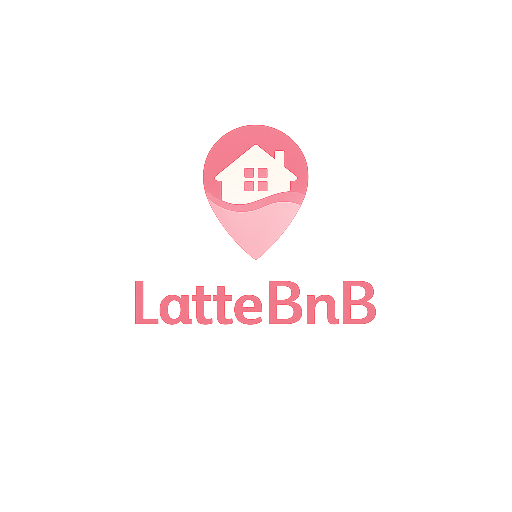

# Latte_BnB

특별한 추억을 만드는 공간, `Latte_BnB`입니다.  
멋쟁이사자처럼 17기 바닐라 프로젝트로 진행한 숙소 예약 서비스 클론 프로젝트입니다.



HTML, Tailwind CSS, JavaScript만으로 멀티 페이지 구조, 공통 컴포넌트, 예약 흐름, 인증 흐름을 구현하는 데 초점을 두고 진행했습니다.

## 프로젝트 개요

- 팀명: `TEAM. VANILLA LATTE`
- 프로젝트 기간: `2026.03.26 ~ 2026.04.20`
- 발표일: `2026.04.20`
- 개발 방식: `Vanilla JS + Vite + Tailwind CSS`
- 배포 주소: `https://latte-bnb.vercel.app/`

## 팀원 소개

| [이동근](https://github.com/dongkeun99Hub) | [이선우](https://github.com/zzz664) | [방효진](https://github.com/lllillly) |
| :---: | :---: | :---: |
|  |  |  |
| 역할 : 조장 | 역할 : 팀원 | 역할 : 팀원 |
| 담당 페이지 : Login, Signup, Reservations List, Reservations Detail, 회원가입/예약 취소 모달, JS 모듈화, api/utils 폴더 컴포넌트화 | 담당 페이지 : Landing, Wishlist, Admin(CRUD/메인/로그인), 공용 컴포넌트(헤더/푸터/햄버거/네비게이션), Toast 모듈, Vercel 배포, 프로토타입 문서 작업 | 담당 페이지 : Accommodations Detail, Reservation Request, Profile, 전반적인 디자인/레이아웃 수정(Login, Signup, Landing 등), Landing 슬라이더, 캘린더 모듈 |

## 기술 스택


## 실행 방법

```bash
npm install
npm run dev
```

빌드와 미리보기:

```bash
npm run build
npm run preview
```

## 주요 기능

- 랜딩 페이지
  - 히어로 슬라이더
  - 숙소 목록 조회
  - 검색 / 정렬 / 페이지네이션
  - 카드 스크롤 페이드 효과
- 숙소 상세 페이지
  - 숙소 정보 조회
  - 이미지 갤러리 및 설명/후기 모달
  - 예약 페이지 이동
- 예약 신청 페이지
  - 캘린더 기반 일정 선택
  - 인원 선택
  - 요금 계산 및 예약 생성
- 예약 목록 / 예약 상세 페이지
  - 예약 목록 조회
  - 예약 상세 조회
  - 예약 취소 모달 처리
- 인증 / 사용자 페이지
  - 로그인 / 회원가입
  - 위시리스트 조회
  - 프로필 조회 / 수정 / 로그아웃 / 회원 탈퇴
- 관리자 페이지
  - 관리자 로그인
  - 숙소 등록 / 수정
  - 관리자 메인 및 숙소 관리 페이지

## 페이지 구성

- `/` : 랜딩 페이지
- `/login/` : 로그인
- `/signup/` : 회원가입
- `/wishlist/` : 위시리스트
- `/profile/` : 프로필
- `/accommodations-detail/` : 숙소 상세
- `/reservation-request/` : 예약 신청
- `/reservations-check/` : 예약 목록
- `/reservations-detail/` : 예약 상세
- `/admin/` : 관리자 메인
- `/admin/login/` : 관리자 로그인
- `/admin/add/` : 숙소 등록
- `/admin/modify/` : 숙소 수정
- `/admin/accommodation/` : 관리자 숙소 관리

## 프로토타입 / 문서

### 프로토타입 문서

- [prototype-Implementation-process.md](./docs/prototype-Implementation-process.md)

<details>
<summary>디자인 시안 문서 보기</summary>

- [랜딩 페이지](./docs/prototype-design-draft/landing.md)
- [로그인 페이지](./docs/prototype-design-draft/login.md)
- [회원가입 페이지](./docs/prototype-design-draft/register.md)
- [숙소 상세 페이지](./docs/prototype-design-draft/accommodation_detail.md)
- [예약 신청 페이지](./docs/prototype-design-draft/reservation_request.md)
- [예약 상세 페이지](./docs/prototype-design-draft/reservation_detail.md)
- [내 예약 목록 페이지](./docs/prototype-design-draft/my_reservation.md)
- [위시리스트 페이지](./docs/prototype-design-draft/wish.md)
- [프로필 페이지](./docs/prototype-design-draft/profile.md)

</details>

### API / 리뷰 문서

- [api-guide.md](./docs/api-guide.md)
- [backend-api-spec.md](./docs/backend-api-spec.md)
- [js-structure-guide.md](./docs/js-structure-guide.md)

## 프로젝트 구조

```text
Latte_BnB/
|-- PULL_REQUEST_TEMPLATE.MD
|-- README.md
|-- accommodations-detail
|   |-- accommodations-detail.js
|   `-- index.html
|-- admin
|   |-- accommodation
|   |   |-- index.html
|   |   `-- index.js
|   |-- accommodationEditorPage.js
|   |-- add
|   |   |-- addAccommodation.js
|   |   |-- index.html
|   |   |-- index.js
|   |   |-- test.html
|   |   `-- test.js
|   |-- adminLanding.js
|   |-- adminLogo.js
|   |-- index.html
|   |-- index.js
|   |-- login
|   |   |-- index.html
|   |   |-- index.js
|   |   `-- login.js
|   `-- modify
|       |-- index.html
|       `-- index.js
|-- eslint.config.mjs
|-- index.html
|-- login
|   |-- index.html
|   `-- index.js
|-- package-lock.json
|-- package.json
|-- profile
|   |-- index.html
|   `-- profile.js
|-- public
|   `-- favicon.svg
|-- reservation-request
|   |-- calendar.js
|   |-- index.html
|   `-- reservation-request.js
|-- reservations-check
|   |-- index.html
|   `-- index.js
|-- reservations-detail
|   |-- index.html
|   `-- index.js
|-- signup
|   |-- index.html
|   `-- index.js
|-- src
|   |-- RoomCard.js
|   |-- api
|   |   |-- auth.js
|   |   |-- client.js
|   |   `-- reservation.js
|   |-- assets
|   |   |-- avatar1.jpg
|   |   |-- avatar2.jpg
|   |   |-- heart.svg
|   |   |-- hero0.jpg
|   |   |-- hero1.jpg
|   |   |-- hero2.jpg
|   |   |-- hero3.jpg
|   |   |-- hero4.jpg
|   |   |-- hero5.jpg
|   |   |-- home.svg
|   |   |-- leftimage.png
|   |   |-- login.svg
|   |   |-- logo.png
|   |   |-- logout.svg
|   |   |-- profile.svg
|   |   |-- reservation-cancel.svg
|   |   |-- reservation.svg
|   |   |-- rightimage.png
|   |   |-- room_thumbnail.webp
|   |   |-- search.svg
|   |   `-- wish.svg
|   |-- components
|   |   |-- FormImage.js
|   |   |-- accommodationForm.delegated.js
|   |   |-- accommodationForm.dom.js
|   |   |-- accommodationForm.js
|   |   |-- accommodationForm.utils.js
|   |   |-- avatar.js
|   |   |-- emptyState.js
|   |   |-- footer.js
|   |   |-- hamburger.js
|   |   |-- header.js
|   |   |-- heroSlider.js
|   |   |-- historyBackButton.js
|   |   |-- modal.js
|   |   |-- navigation.js
|   |   |-- numberInput.js
|   |   |-- pagination.js
|   |   |-- postcodeSearch.js
|   |   |-- toast.js
|   |   `-- togglePassword.js
|   |-- constants.js
|   |-- landing.js
|   |-- main.js
|   |-- style.css
|   |-- styles
|   |   `-- toast.css
|   `-- utils
|       |-- auth.js
|       `-- validate.js
|-- vite.config.js
`-- wishlist
    |-- index.html
    `-- index.js
```

## 서비스 소개

서비스 화면 이미지는 추후 추가 예정입니다.

### 랜딩 페이지

- 히어로 슬라이더
- 검색 / 정렬 / 페이지네이션
- 숙소 카드 목록
- TOP 버튼
- 이미지 추가 예정

### 숙소 상세 페이지

- 숙소 대표 이미지
- 숙소 정보 / 호스트 정보
- 가격 영역과 예약 버튼
- 후기 / 설명 모달
- 이미지 추가 예정

### 예약 요청 페이지

- 일정 선택
- 인원 선택
- 요금 계산
- 예약 생성 흐름
- 이미지 추가 예정

### 예약 목록 / 예약 상세 페이지

- 예약 목록 카드 조회
- 예약 상세 정보 확인
- 결제 정보 확인
- 예약 취소 모달 처리
- 이미지 추가 예정

### 위시리스트 / 프로필 페이지

- 찜한 숙소 목록 조회
- 프로필 정보 확인 / 수정
- 로그아웃 / 회원 탈퇴
- 이미지 추가 예정

### 로그인 / 회원가입 페이지

- 로그인 폼
- 회원가입 폼
- 입력 검증
- 반응형 레이아웃
- 이미지 추가 예정

### 관리자 페이지

- 관리자 로그인
- 관리자 메인
- 숙소 등록 / 수정 / 삭제
- 관리자 화면 이미지는 추가 정리 후 반영 예정입니다.

## 트러블 슈팅

| 문제 | 해결 방식 | 강사님 리뷰명 |
| --- | --- | --- |
| `calendar.js`가 전역 스크립트로 동작해 다른 페이지와 변수 충돌이 나던 문제 | ES 모듈로 전환하고 `export / import` 방식으로 바꿔 필요한 값만 주고받도록 수정 | `review-20260407.md` |
| 페이지마다 모달 열기/닫기 방식이 달라 유지보수가 어려웠던 문제 | `openModal()` / `closeModal()` 공통 함수로 모달 동작을 통일 | `review-20260414.md` |
| 401 처리 로직이 에러 메시지 문자열에 의존하던 문제 | `error.message` 대신 `error.status === 401`로 숫자 비교하도록 수정 | `review-20260414.md` |
| 프로필 기본 bio 문구가 상황마다 달라 수정 모달에 안내 문구가 실제 값처럼 들어가던 문제 | `EMPTY_BIO_TEXT` 상수와 `renderProfile()`로 표시 로직을 한곳으로 통일 | `review-20260415.md` |
| 지역 삭제 시 빈 값이 서버에 전달되지 않아 기존 지역이 남을 수 있던 문제 | `region` 값을 항상 요청에 포함해 삭제 의도를 명확히 전달하도록 수정 | `review-20260415.md` |
| 만료된 토큰일 때 공통 인증 흐름이 끊기며 네비게이션 렌더링까지 영향을 받던 문제 | `main.js`의 `checkAuth()`에서 토큰 없음과 401 상황을 모두 비로그인 상태로 안전하게 처리 | `X` |

## 회고 / 리뷰 문서

프로젝트 진행 중 정리한 리뷰 문서는 `docs/review-*.md` 파일에 모아두었습니다.

## 프로젝트 소감

| 이름 | 소감 |
| --- | --- |
| 이동근 | 회고조와 우버 프로젝트를 할 때만 해도 5명이서 한 페이지를 끙끙대면서 겨우 만들었었는데, 이제는 한 명당 3~4페이지는 거뜬하게 만들 수 있으니 성장했다고 생각합니다. 이 정도 스케일의 프로젝트는 처음이었지만 팀원 모두 큰 문제 없이 잘 마쳐서 다행인 것 같습니다. 조장으로서 팀을 잘 이끌지는 못했지만 모두 묵묵히 본인의 할 일을 끝마쳐줘서 고맙고 자랑스럽습니다. 그리고 다시금 “하면 된다”라는 것을 느꼈습니다. 17기 모두 파이널까지 잘 마쳐서 취업에 성공했으면 좋겠습니다. |
| 이선우 | 바닐라 JS + HTML + CSS 조합으로 이 정도 규모의 프로젝트를 만들어본 적이 없었는데, 책임 분리 설계, 효율적인 DOM 업데이트, 공통적으로 사용되는 부분을 찾아 중복되는 코드를 줄이는 설계를 직접 적용해볼 수 있어서 좋았습니다. 팀원들과 불화 없이 협업하며 각자 맡은 바를 잘 완수해 성공적으로 프로젝트를 끝낸 것 같아 뿌듯합니다. |
| 방효진 | 직접 만나서 하는 게 아니라 온라인으로 작업하는 팀 프로젝트를 한다고 했을 때 처음에는 걱정이 많았는데, 팀원분들이 너무 열심히 잘해주셔서 행복한 프로젝트를 할 수 있었습니다. 프로젝트를 하면서 강사님께 칭찬받았을 때 특히 뿌듯했고, 무사히 프로젝트를 마치게 되어 정말 기뻤습니다. 막상 마무리하려니 기분이 좋기도 하지만 시간이 지날수록 더 완벽하게 하고 싶은 마음이 들어 시원섭섭한 것 같습니다. 너무 행복한 팀 프로젝트였습니다. |
